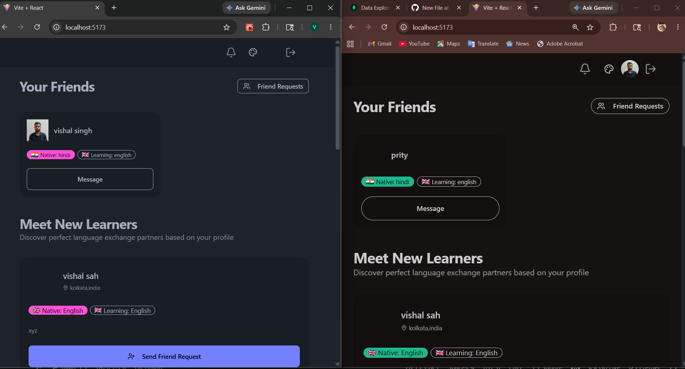
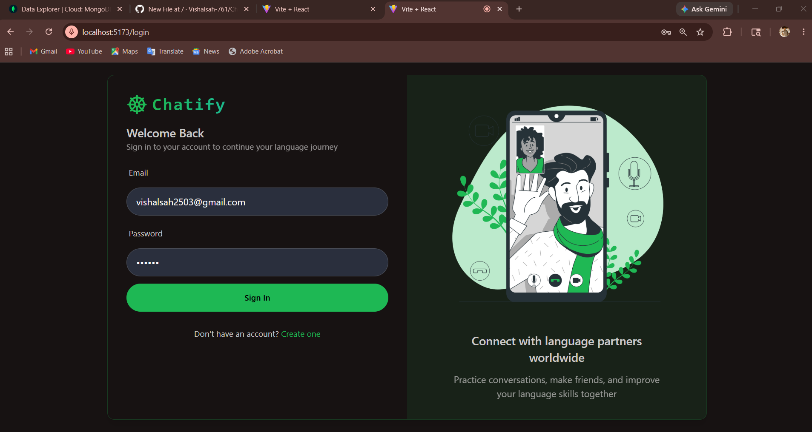
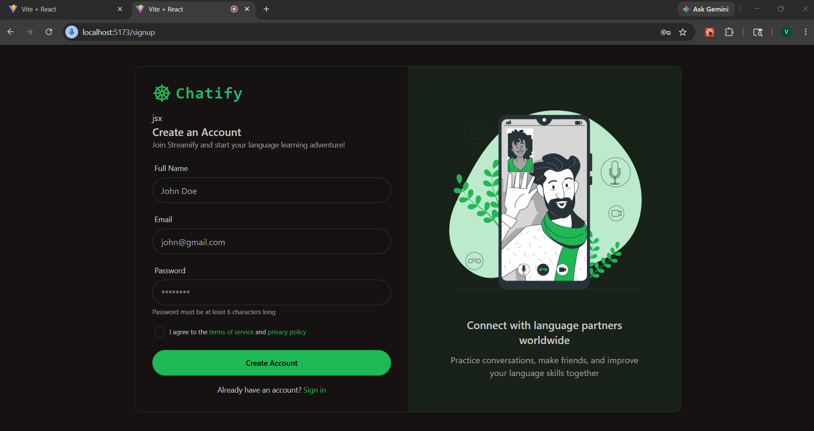
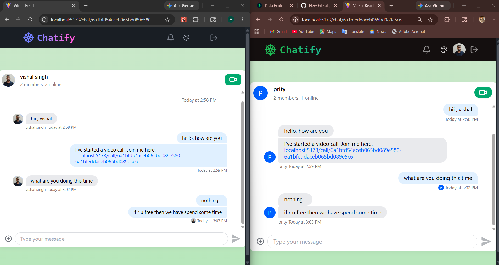
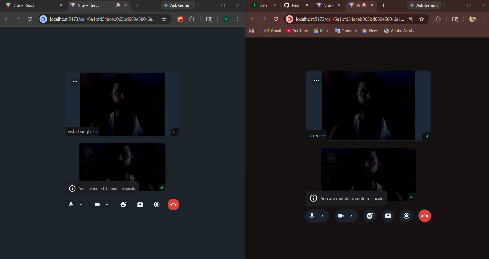

# 🚀 Chatify - Real-Time Chat & Video Calling Platform

Chatify is a modern full-stack communication platform built using the MERN Stack. It enables users to communicate through real-time messaging, profile management, and video calling capabilities.

The project is fully containerized using Docker and uses MongoDB Atlas for database management and Cloudinary for media storage.

---

# 🌟 Features

## 🔐 Authentication & Security

* User Registration
* User Login
* JWT Authentication
* Secure Password Hashing
* Protected Routes

## 👤 Profile Management

* Profile Setup
* Update Profile Information
* Upload Profile Picture
* Cloudinary Image Storage

## 💬 Real-Time Messaging

* One-to-One Chat
* Instant Message Delivery
* Online User Status
* Responsive Chat Interface

## 📹 Video Calling

* Real-Time Video Calling
* User-to-User Communication
* Smooth Calling Experience

## ☁️ Cloud Services

* MongoDB Atlas Integration
* Cloudinary Integration

## 🐳 DevOps

* Dockerized Backend
* Dockerized Frontend
* Docker Compose Support
* Docker Hub Published Images

---

# 🛠️ Tech Stack

### Frontend

* React.js
* Vite
* JavaScript
* CSS

### Backend

* Node.js
* Express.js
* MongoDB
* Mongoose
* JWT
* Bcrypt

### Cloud Services

* MongoDB Atlas
* Cloudinary

### DevOps

* Docker
* Docker Compose
* Docker Hub

---

# 📸 Application Screenshots

## 🏠 Home Page



---

## 🔑 Login Page



---

## 📝 Signup Page



---

## 💬 Real-Time Messaging



---

## 📹 Video Calling



---

# 📂 Project Structure

```text
Chatify/
│
├── backend/
│   ├── src/
│   ├── Dockerfile
│   ├── .dockerignore
│   └── package.json
│
├── frontend/
│   ├── src/
│   ├── Dockerfile
│   ├── .dockerignore
│   └── package.json
│
├── screenshots/
│   ├── homePage.png
│   ├── login.png
│   ├── signup.png
│   ├── message.png
│   └── video_Calling.png
│
├── docker-compose.yml
│
└── README.md
```

---

# ⚙️ Environment Variables

## Backend (.env)

```env
PORT=5001

MONGO_URI=your_mongodb_connection_string

JWT_SECRET=your_jwt_secret

CLOUDINARY_CLOUD_NAME=your_cloud_name

CLOUDINARY_API_KEY=your_api_key

CLOUDINARY_API_SECRET=your_api_secret
```

## Frontend (.env)

```env
VITE_API_URL=http://localhost:5001
```

---

# 🚀 Installation

## Clone Repository

```bash
git clone https://github.com/Vishalsah-761/ChatApp.git

cd ChatApp
```

---

# ▶️ Run Locally

## Backend

```bash
cd backend

npm install

npm run dev
```

## Frontend

```bash
cd frontend

npm install

npm run dev
```

---

# 🐳 Docker Setup

## Build Docker Images

```bash
docker compose build
```

## Run Containers

```bash
docker compose up -d
```

## Stop Containers

```bash
docker compose down
```

## View Running Containers

```bash
docker ps
```

## View Logs

```bash
docker compose logs
```

---

# 📦 Docker Hub Images

## Backend

```bash
docker pull vishal761/chatify-backend:latest
```

## Frontend

```bash
docker pull vishal761/chatify-frontend:latest
```

Docker Hub Profile:

https://hub.docker.com/u/vishal761

---

# 🌐 Application URLs

### Frontend

```text
http://localhost:5173
```

### Backend

```text
http://localhost:5001
```

---

# 🎯 Skills Demonstrated

* Full Stack MERN Development
* REST API Development
* Authentication & Authorization
* MongoDB Atlas Integration
* Cloudinary Integration
* Real-Time Messaging
* Video Calling Features
* Docker Containerization
* Docker Compose
* Docker Hub Image Publishing
* Git & GitHub Workflow
* Responsive UI Development

---

# 🔮 Future Enhancements

* Group Chat
* Group Video Calling
* Voice Messages
* Push Notifications
* Message Reactions
* Message Search
* Kubernetes Deployment
* CI/CD using GitHub Actions

---

# 👨‍💻 Author

### Vishal Sah

GitHub:
https://github.com/Vishalsah-761

Docker Hub:
https://hub.docker.com/u/vishal761

---

# ⭐ Support

If you found this project useful, please consider giving it a star on GitHub.

---

# 📄 License

This project is licensed under the MIT License.
